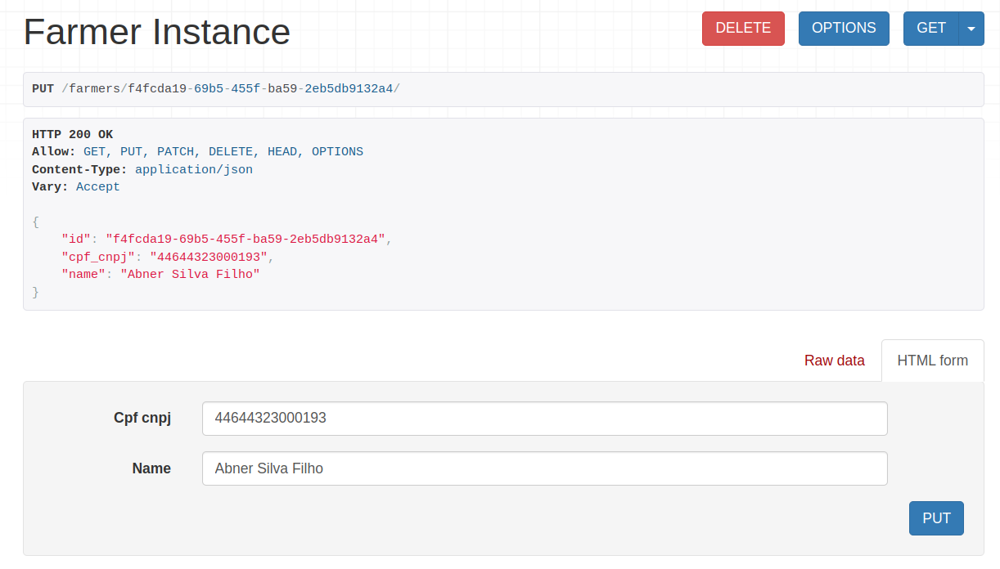

# Farm API

[README em Português 🇧🇷](README_pt-br.md)

REST API developed with Python, Django and Postgres. **Objective:** register, edit and delete farmers and provide an endpoint with data for dashboard use, these being in their respective endpoint */dashboard*:
- Total farms in quantity: `farm_count`
- Total farms in hectares (total area): `total_area_hectares`
- Pie chart by state: `count_by_state`
- Pie chart by crop: `farm_count_by_crop`
- Pie chart by land use (arable area and vegetation): `soil_usage`

## Application Architecture

Important points:

- `agro/`: app that centralizes models, views, serializers, tests and business logic;
- `agro/business/dashboard.py`: aggregates operations for the main endpoint already mentioned;
- `agro/business/validators.py`: validation logic on the areas of a farm;
- `agro/models.py`: stores all models, their relationships and specific configurations;
- `agro/serializers.py`: in addition to dealing with serialization processes, it implements some input validations also related to the business logic;
- `agro/views.py`: has endpoints to create, edit and delete all entities according to the models, in addition to a customized endpoint for the dashboard;
- `agro/tests/`: due to the wide coverage of automated tests, the test suite was implemented in a package instead of a simple file, facilitating division into groups, types and different test scenarios.

## Configurations

Installation requirements:

- [Git](https://git-scm.com/downloads)
- [Docker](https://docs.docker.com/engine/install/)
- [Docker Compose](https://docs.docker.com/compose/migrate/)

After installation/configuration of requirements:

1. Clone this repository: `git clone https://github.com/daltroedu/brain-ag-teste`
2. Go to the project: `cd brain-ag-teste/`
3. We use *Makefile* to simplify command execution, instead of:
    - ~~`docker-compose build`~~ just do it:
    - `make build` to build the containers!
4. Build finished, upload the application with `make up-d` (or `make up`, if you want to follow the logs in the terminal). But first make sure that ports 8000 and 5432 (Django and Postgres) are available
5. Now you need to perform the migrations to the database: `make migrate`
6. Run the tests to make sure everything went well: `make pytest`

7. Your application is ready! Visit: http://localhost:8000/
8. To insert some example data into the database: `make loaddata-agro`
9. And finally, if you want to close the application/database: `make stop`

Other commands:
- `make linting-check`: to check code quality with flake8, isort and black;
- `make linting-apply`: applies the changes.

## Endpoints

**Link to test the application online: https://brain-ag-teste.fly.dev/**

NOTE: limited to 25 requests/min, for security and server availability reasons.

To facilitate the use of endpoints, we will work with the Django REST Framework navigable API:

To create a farmer, go to: `http://localhost:8000/farmers/`

Enter a valid [CPF](https://www.4devs.com.br/gerador_de_cpf) or [CNPJ](https://www.4devs.com.br/gerador_de_cnpj) (with or without a mask) and a name:

NOTE: CPF and CNPJ are unique identifiers for people and companies in Brazil, respectively.

Now let's create a farm, go to: `http://localhost:8000/farms/`

NOTE: Only states (provinces) in Brazil, [see a list of cities in Brazil here](https://pt.wikipedia.org/wiki/Lista_de_munic%C3%ADpios_do_Brasil).

Comments:
- A `farmer` can have more than one `farm`, but not vice versa;
- `total_area_hectares` must be >= 0;
- `arable_area_hectares` + `vegetation_area_hectares` cannot be greater than `total_area_hectares`.

To control the types of crops and normalization in the database, you can register them on the endpoint (eg.: Soy, Coffee, Corn, etc.) `http://localhost:8000/crops_type/`:

Go to `http://localhost:8000/crops/` to associate farm x crop, and a farm can have more than one crop:

Finally, to get the dashboard endpoint: `http://localhost:8000/dashboard/`

If you need to edit or delete a farmer, go to http://localhost:8000/farmers/(id)/ using the id as a parameter, also valid for other endpoints (except */dashboard*):

Feel free to test the API through other means as well, such as Insomnia or Postman:
