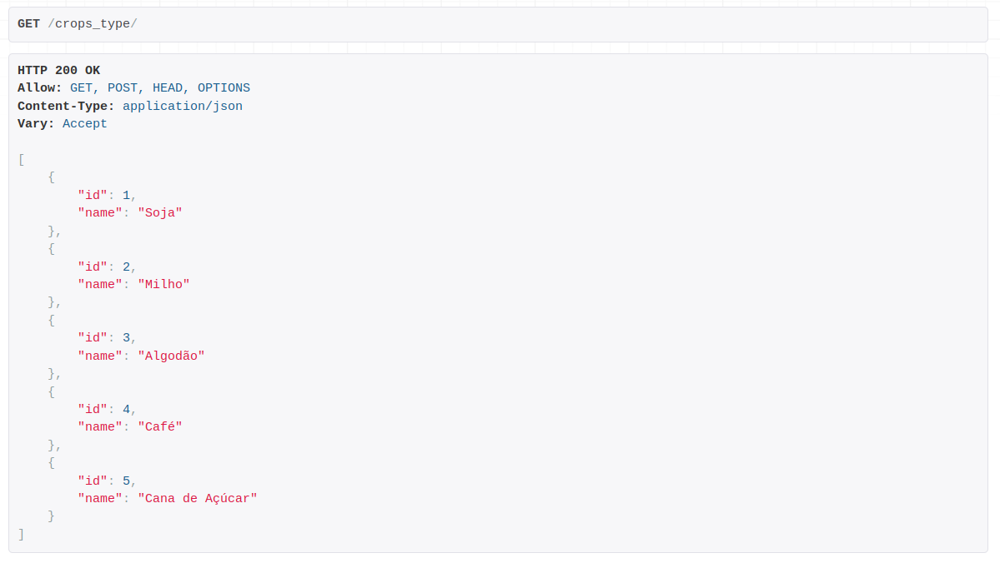

# Brain AG Teste

API REST desenvolvida com Python, Django e Postgres. **Objetivo:** cadastrar, editar e exluir produtores rurais e disponibilizar um endpoint com dados para uso de dashboard, sendo estes em seu respectivo endpoint */dashboard*:
- Total de fazendas em quantidade: `farm_count`
- Total de fazendas em hectares (área total): `total_area_hectares`
- Gráfico de pizza por estado: `count_by_state`
- Gráfico de pizza por cultura: `farm_count_by_crop`
- Gráfico de pizza por uso de solo (área agricultável e vegetação):  `soil_usage`

## Estrutura

Partes pertinentes da aplicação:

- `agro/`: app que centraliza models, views, serializers, testes e regras de negócio;
- `agro/business/dashboard.py`: agrega as operações para o principal endpoint já citado;
- `agro/business/validators.py`: lógica de validação sobre as áreas de uma fazenda;
- `agro/models.py`: armazena todos os models, seus relacionamentos e configurações específicas;
- `agro/serializers.py`: além de lidar com processos de serialização, implementa algumas validações de entrada também relacionadas com a regra de negócio;
- `agro/views.py`: dispõe dos endpoints para criar, editar e excluir todas entidades de acordo com os models, além de um endpoint customizado para o dashboard;
- `agro/tests/`: devido à grande cobertura de testes automatizados, a suíte de testes foi implementada em um pacote ao invés de um simples arquivo, facilitando a divisão por grupos, tipos e diferentes cenários de teste.

## Configurações

Requisitos de instalação:

- [Git](https://git-scm.com/downloads)
- [Docker](https://docs.docker.com/engine/install/)
- [Docker Compose](https://docs.docker.com/compose/migrate/)

Após instalar os requisitos:

1. Clone este repositório: `git clone <>`
2. Acesse o projeto: `cd brain-ag-teste/`
3. Utilizamos *Makefile* para simplificar a execução dos comandos, ao invés de:
    - ~~`docker-compose build`~~
    apenas faça:
    - `make build`
    para construir os containers!
4. Build finalizado, suba a aplicação com `make up-d` (ou `make up`, caso queira acompanhar os logs no terminal)
5. Agora você precisa efetuar as migrações para o banco de dados, faça: `make migrate`
6. Execute os testes para ter certeza que tudo ocorreu bem: `make pytest`

7. Sua aplicação está pronta! Acesse: http://localhost:8000/
8. Para inserir alguns dados de exemplo no banco de dados, faça: `make loaddata-agro`
9. E por fim, caso queira encerrar a aplicação/banco de dados: `make stop`

Outros comandos:
- `make linting-check`: para verificar qualidade de código com flake8, isort e black;
- `make linting-apply`: aplica as mudanças, se houverem.

## Endpoints

**Link para testar a aplicação online: https://brain-ag-teste.fly.dev/**

Para facilitar a utilização dos endpoints vamos trabalhar com a API navegável do Django REST Framework:

Para criar um produtor rural, acesse: `http://localhost:8000/farmers/`

Insira um [CPF](https://www.4devs.com.br/gerador_de_cpf)/[CNPJ](https://www.4devs.com.br/gerador_de_cnpj) válido (com ou sem máscara) e um nome:

Agora vamos criar uma fazenda, acesse: `http://localhost:8000/farms/`

**Observações:**
- Um produtor rural (`farmer`) pode ter mais de uma fazenda (`farm`), mas não o contrário;
- `total_area_hectares` precisa ser >= 0;
- `arable_area_hectares` + `vegetation_area_hectares` não pode ser maior que `total_area_hectares`.

Visando controle sobre os tipos de cultura e normalização no banco de dados, você pode cadastrá-las no endpoint `http://localhost:8000/crops_type/`:

Acesse `http://localhost:8000/crops/` para associar fazenda x cultura, sendo que uma fazenda pode ter mais de uma cultura:

E para acessar o endpoint do dashboard: `http://localhost:8000/dashboard/`

Caso precise editar ou excluir um produtor rural acesse http://localhost:8000/farmers/(id)/, válido também para os outros endpoints:

Sinta-se à vontade para testar a API também por outros meios, como Insomnia ou Postman:
